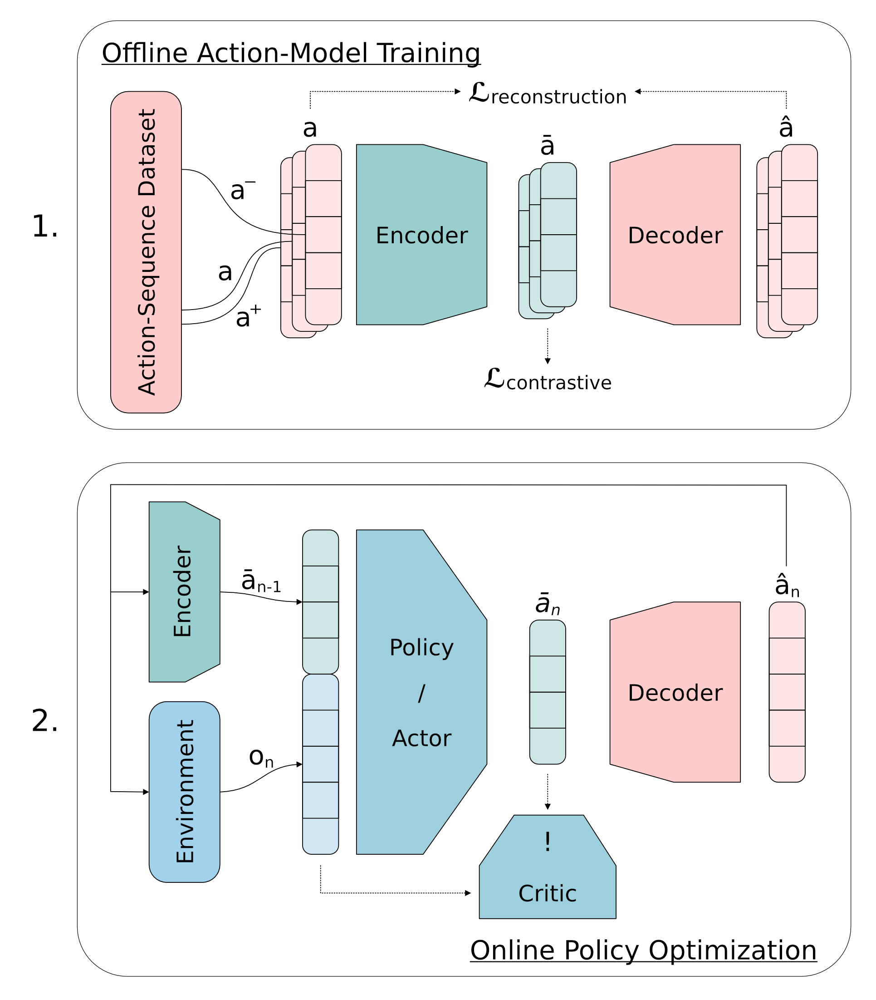

<!-- PROJECT LOGO -->
<br />
<div align="center">
    
    <h1 align="center">Action2vec guided SAC</h1>
</div>


<!-- ABOUT THE PROJECT -->
## About The Project

Here you can find the code of my final project for the lecture <a href="https://automl-edu.github.io/advanced-topics-in-deep-rl/">Advanced Topics in Deep Reinforcement Learning</a>

<div align="center">
    <h4 align="center">Visualization of the Approach</h4>
    
</div>

### Built With

<table align="center">
<!--
<td>
    <a href="https://pytorch.com">
    
    </a>
</td>
-->
<td>
    <a href="https://robotics.farama.org">
    
    </a>
</td>
<td>
    <h1>
    <a href="https://github.com/vwxyzjn/cleanrl">
    CleanRL</a>
    </h1>
</td>
<td>
    <a href="https://minari.farama.org">
    
    </a>
</td>
</table>


<!-- GETTING STARTED -->
## Getting Started
### Installation
Download the project:

```shell
 git clone git@github.com:Peer222/adrl_project.git
 cd adrl_project
 ```

#### Conda
Create a conda environment:

```bash
conda create -n adrl_project python=3.10
conda activate adrl_project
pip install -r requirements.txt
```

### Data
The expert dataset of the [AdroitHandDoor-v1](https://robotics.farama.org/envs/adroit_hand/adroit_door/) gymnasium-robotics environment from [Minari](https://minari.farama.org/datasets/D4RL/door/expert-v2/) is used.

The dataset is downloaded automatically by minari when `action_model/train.py` is executed.
If no internet connection is available during execution, the dataset can also be pre-downloaded with the following command:
```bash
minari download door-expert-v2
```

<!-- USAGE EXAMPLES -->
## Usage
First you should log in your wandb account by running
```shell
wandb login
```

You can also run all scripts without wandb tracking by adding the option --no-track

You can run experiments using the action sequence model:

```shell
python action_model/train.py --wandb_entity `your_wandb_entity` --wandb_project_name `your_wandb_project`
```
You can also run the SAC extensions and baseline by e.g.:
```shell
python algorithms/sac_ca_extended_obs.py --action_model_dir `path/to/saved/action_models` --wandb_entity `your_wandb_entity` --wandb_project_name `your_wandb_project`
```

To get more information run the scripts with the `--help` flag.

If you want to reproduce the results, you can execute the following bash scripts (with slurm):

```shell
sbatch scripts/action_model_experiment.sh `your_wandb_entity` `your_wandb_project` `offline or online`
sbatch scripts/sac_baseline_experiment.sh `your_wandb_entity` `your_wandb_project` `offline or online`
sbatch scripts/sac_extended_obs_experiment.sh `your_wandb_entity` `your_wandb_project` `offline or online`
sbatch scripts/sac_latent_actions_experiment.sh `your_wandb_entity` `your_wandb_project` `offline or online`
sbatch scripts/sac_latent_actions_extended_experiment.sh `your_wandb_entity` `your_wandb_project` `offline or online`
```

If wandb mode is set to offline, you have to manually upload the run statistics to the wandb server:
```shell
wandb sync `offline-run-identifier`
```

To download the data again and to store it as csv files, run:
```shell
./scripts/get_wandb_action_run_data.sh `your_wandb_entity` `your_wandb_project`
./scripts/get_wandb_run_data.sh `your_wandb_entity` `your_wandb_project`
```

You can create the plots by running:
```shell
./scripts/plot_action_model.sh
./scripts/plot_algorithm_multi.sh
./scripts/plot_algorithm_single.sh
```
